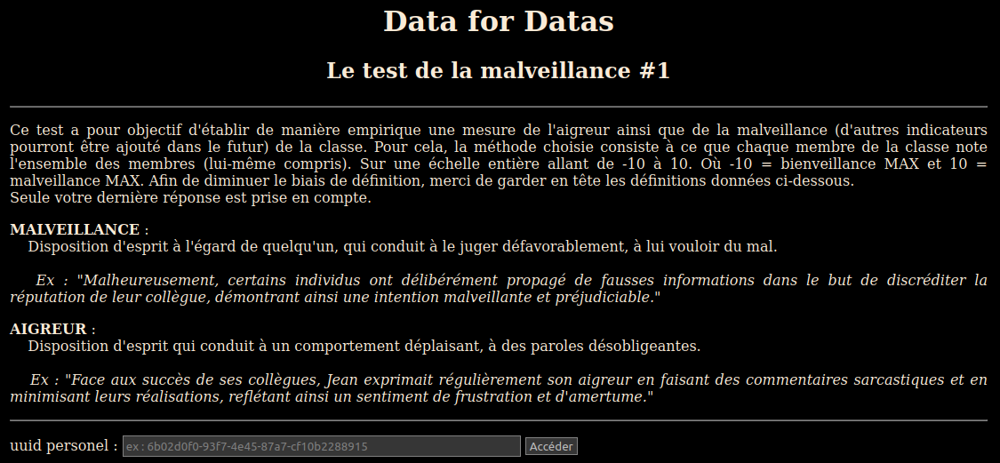

# data4datas

Ce projet est un site web en php qui a pour objectif de récupérer votes de la classe des datas sur différents sujets.

Chaque utilisateur à un uuidv4, à saisir dans l'écran d'accueil pour accéder à l'écran de saisie.

